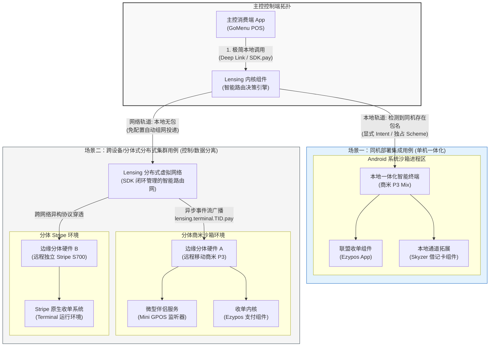
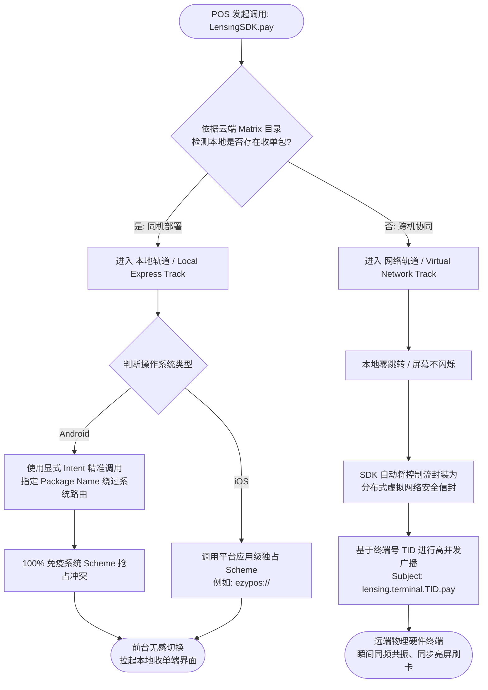
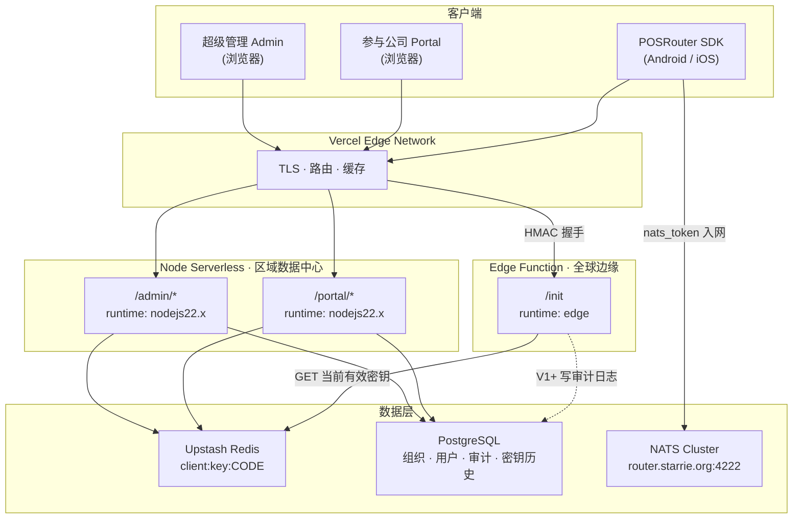
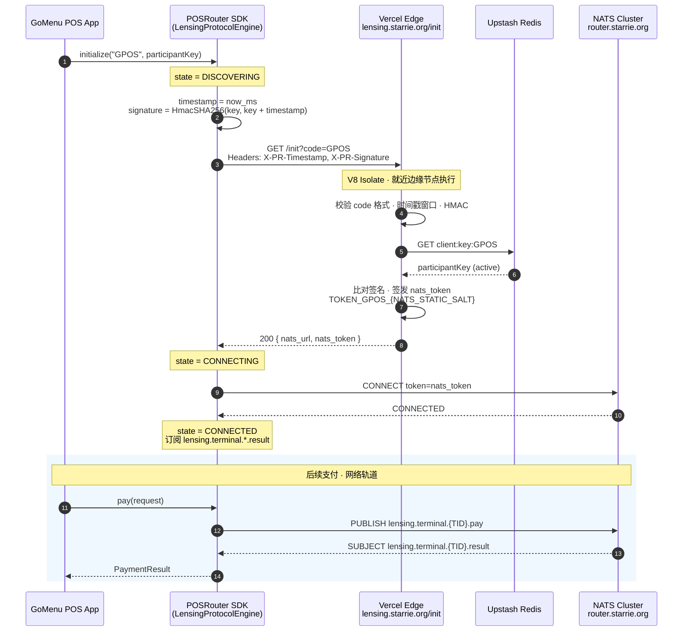
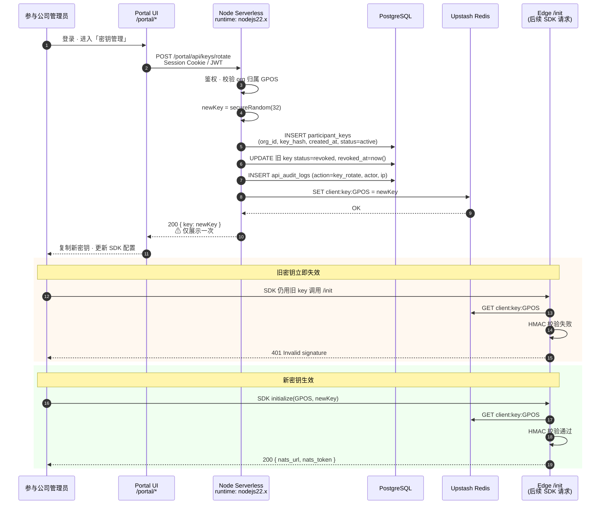
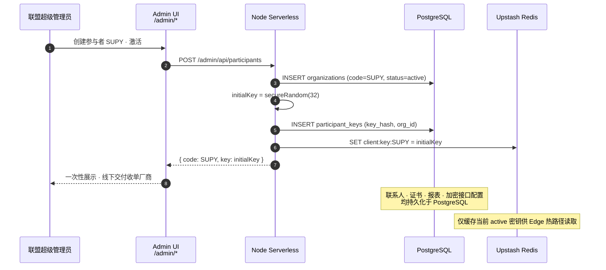

# POSRouter / Lensing Protocol Specification (V0.4)

> **POSRouter** is the outward-facing brand, package namespace, and API surface.
> The underlying networking protocol is legally and technically named the **Lensing Protocol**.

---

## 1. 概述与核心愿景

本规范旨在定义 Starrie 联盟旗下的 **Lensing 分布式支付编排协议** 及其商业准入生态模型。本协议旨在彻底消除消费系统与支付系统集成时的底层网络复杂性，通过将底层通信技术完全封装于免费提供的轻量级 SDK 中，为生态成员建立一个高内聚、弱耦合、跨平台一致的收单基础设施。

为了最大化扩大生态圈，本协议实行"双轨包容制"：联盟免费向 POS 厂商提供标准 SDK 以隐丝般无感地嵌入其收银软件中，实现高级的跨机协同与智能路由；同时，对于极度排斥第三方二进制依赖、或处于极简交互需求的厂商，协议完全保留第一阶段的松耦合 Deep Link 本地直调标准，允许其低成本快速接入，后续再平滑引导其升级。

---

## 2. 核心设计哲学

* **隐藏底层复杂性**：将高并发分布式协同、网络心跳感知、物理状态机维护等重型技术细节彻底锁死在 SDK 内核中。对外呈现极简的单一控制流，大幅遮挡 POS 厂商的研发成本。
* **数据与控制流分离**：本地界面切换与唤醒仅承载轻量级控制元数据（肉眼可读），而海量数据、对账流水及大段电子小票文本全部交由高性能分布式虚拟网络通道进行异步交割，杜绝系统级通信截断。

---

## 3. Starrie Lensing 联盟准入与合规规范 (联盟核心 IP 治理)

* **4位字母参与者代码 (Participant Code)**：新联盟成员在获准接入生态前，必须主动向联盟申请并获批一个专属的 4 位全大写字母代号（例如：收单端 Supay 对应 `SUPY`，消费端 GoMenu 对应 `GPOS`）。

---

## 4. NATS Subject 路由规范

| 方向 | Subject 模式 | 说明 |
|------|-------------|------|
| POS → Terminal | `lensing.terminal.{TID}.pay` | 控制流支付请求广播 |
| Terminal → POS | `lensing.terminal.{TID}.result` | 支付结果异步回传 |

`{TID}` 为终端号 (Terminal ID)，由收单端在联盟 Matrix 目录中注册。

---

## 5. 支付请求载荷 (PaymentRequest JSON Schema)

跨 Android / iOS / Gateway 统一的 JSON 序列化格式：

```json
{
  "terminalId": "TID001",
  "amount": 1250,
  "currency": "USD",
  "targetPackageName": "com.ezypos.app",
  "targetScheme": "ezypos://",
  "metadata": {}
}
```

| 字段 | 类型 | 必填 | 说明 |
|------|------|------|------|
| `terminalId` | string | ✓ | 目标终端号 |
| `amount` | integer | ✓ | 金额（最小货币单位，如分） |
| `currency` | string | ✓ | ISO 4217 货币代码 |
| `targetPackageName` | string | Android | 本地轨道收单 App 包名 |
| `targetScheme` | string | iOS | 本地轨道独占 URL Scheme |
| `metadata` | object | ✗ | 扩展元数据 |

---

## 6. 支付结果载荷 (PaymentResult JSON Schema)

```json
{
  "terminalId": "TID001",
  "status": "approved",
  "transactionId": "txn_abc123",
  "amount": 1250,
  "currency": "USD",
  "message": "Payment approved"
}
```

| `status` 枚举 | 说明 |
|---------------|------|
| `approved` | 支付成功 |
| `declined` | 支付拒绝 |
| `cancelled` | 用户取消 |
| `error` | 系统错误 |

---

## 7. 核心流程图定义 (Mermaid)

### 7.1 Lensing 全景运行用例图



### 7.2 智能路由决策机制的流程图



---

## 8. Gateway 认证握手（V0.5 现行）

> **路线决策**：维持本节对称 HMAC 实现直至 V2 落地；**跳过** V1 对称密钥中间态（Redis 密文 blob、服务端存 `SHA256(key)` 等）。终态见 **§14**。

SDK 初始化时向 Gateway 发起 HTTP GET：

```
GET https://lensing.starrie.org/init?code=GPOS
Headers:
  X-PR-Timestamp: <unix_ms>
  X-PR-Signature: HmacSHA256(key + timestamp)
```

成功响应：

```json
{
  "nats_url": "nats://router.starrie.org:4222",
  "nats_token": "TOKEN_GPOS_<SECRET_SALT>"
}
```

### 8.1 V0.5 密钥与传输（现行）

| 项目 | 行为 |
|------|------|
| SDK 持有 | 参与者对称密钥 `key`（明文，建议 Keychain / Keystore） |
| Redis | `client:key:{CODE}` = 明文 `key`（Upstash 持久化） |
| 网络传输 | **不传** `key`；仅 `X-PR-Timestamp` + `X-PR-Signature` |
| 签名 | `HMAC-SHA256(key, key + timestamp)` → hex |

Edge 每次请求从 Redis 读取 `key` 验签，**不在 Edge 持久存储**；内存用完即释。

---

## 9. Lensing 内核状态机

| 状态 | 说明 |
|------|------|
| `IDLE` | 未初始化 |
| `DISCOVERING` | 正在向 Gateway 请求 NATS 凭证 |
| `CONNECTING` | 正在建立 NATS 连接 |
| `CONNECTED` | 已连接，可收发消息 |
| `RECONNECTING` | 连接断开，指数退避重连中 |
| `FAILED` | 不可恢复错误 |

断开连接时，出站消息进入本地 fallback 队列，重连成功后自动 flush。

---

## 10. Gateway 运行时架构 (Vercel Edge / Node Serverless)

联盟 Gateway 部署于 Vercel，按路由拆分 **Edge Function** 与 **Node.js Serverless**，实现「全球低延迟鉴权 + 完整 Node 运营能力」。

### 10.1 执行环境对比

| 维度 | Edge Function | Node.js Serverless |
|------|---------------|-------------------|
| **部署位置** | 全球 CDN 边缘节点（就近用户） | 区域数据中心（如 `iad1`，与数据库同区） |
| **底层** | V8 Isolate + Edge Runtime（WinterCG） | 完整 Node.js 18 / 20 / 22 进程 |
| **冷启动** | 极快，适合高频短请求 | 有冷启动，可调 `maxDuration` / `memory` |
| **典型路由** | `/init` | `/admin/*`、`/portal/*` |
| **适用能力** | `fetch`、Web Crypto、Upstash REST | Prisma、PostgreSQL、`bcrypt`、PDF 证书生成 |
| **不适用** | `fs`、原生 DB 驱动、长时 CPU 任务 | — |

### 10.2 请求路由拓扑



### 10.3 SvelteKit 路由与 Runtime 映射

| URL | Runtime | 职责 |
|-----|---------|------|
| `GET /init` | `edge` | 参与者 HMAC 鉴权、签发 NATS token |
| `/portal/*` | `nodejs22.x` | 参与公司自助：联系人、查看/轮换 key、集成测试 |
| `/admin/*` | `nodejs22.x` | 超级管理：激活成员、分配密钥、报表、加密接口配置 |

适配器配置：`adapter-vercel` 全局默认 `nodejs22.x` + `split: true`；仅 `init/+server.ts` 导出 `export const config = { runtime: 'edge' }`。

---

## 11. 时序：SDK 初始化 → Edge `/init` → NATS 入网

消费端 POS（参与者代码 `GPOS`）在应用启动或首次支付前调用 `POSRouter.initialize(code, key)`。热路径全程走 Edge，不经过 Node Serverless。



**要点：**

- 参与者私钥 `participantKey` 仅存于 SDK 本地与 Redis `client:key:GPOS`；`NATS_STATIC_SALT` 仅存在于 Vercel 环境变量，用于生成 NATS token。
- Edge 不连接 PostgreSQL；V1+ 可选异步 `waitUntil` 写入 API 审计表（不阻塞响应）。

---

## 12. 时序：参与方密钥轮换 (Portal → Node → PostgreSQL + Redis)

参与公司通过 Portal 轮换密钥。写路径走 **Node Serverless**（完整 Node + 数据库），再同步 **Redis 热缓存** 供 Edge `/init` 读取。



### 12.1 超级管理：激活成员与分配密钥



### 12.2 存储职责划分（运营平台目标）

> V1 对称密钥中间态（Postgres `key_hash` + Redis 明文/密文轮换）**不实施**；运营平台与 `/init` 终态统一对齐 **§14 不对称模型**。

| 数据 | PostgreSQL | Redis (Upstash) |
|------|------------|-----------------|
| 组织 / 用户 / 角色 | ✓ 主库 | — |
| 公钥版本 / 轮换审计 | ✓ | 仅当前 active 公钥 |
| API 调用记录 / 报表 | ✓（量大可分区） | 可选限流计数 |
| `/init` 鉴权热路径（V2） | 公钥归档 | `client:pubkey:{CODE}` |
| `/init` 鉴权热路径（V0.5 现行） | — | `client:key:{CODE}` 明文 |
| Participant 证书元数据 | ✓ | — |
| 证书 PDF / PEM 文件 | 元数据 | Blob / S3 |

---

## 14. Gateway 认证终态（V2）：客户端不对称密钥

联盟目标模型：**密钥对在客户端本地生成**；**私钥永不离开设备**；服务端（Postgres + Redis）**仅存储公钥**。与 Participant 证书、Portal 公钥轮换、Edge `/init` 验签统一为一条技术路线。

### 14.1 与 V0.5 的差异

| | V0.5（现行） | V2（终态） |
|--|-------------|-----------|
| 客户端秘密 | 对称 `key`（联盟下发） | **私钥**（本地生成） |
| 服务端存储 | Redis 对称 `key` 明文 | **公钥**（可缓存于 Redis） |
| `/init` 证明方式 | HMAC | **数字签名**（推荐 Ed25519） |
| 泄露 Redis | 可伪造 HMAC | **不能**冒充签名（无私钥） |
| 入网流程 | Admin 生成 key → Redis SET | SDK 生成 pair → Portal 注册公钥 |

### 14.2 入网与存储

```mermaid
sequenceDiagram
    autonumber
    participant SDK as POSRouter SDK
    participant Portal as Portal / Admin
    participant Node as Node Serverless
    participant PG as PostgreSQL
    participant Redis as Upstash Redis

    SDK->>SDK: 首次启动 · 生成 Ed25519 key pair
    Note over SDK: 私钥 → Keychain / Keystore<br>永不上传

    SDK->>Portal: 提交公钥 + 参与者 code 绑定申请
    Portal->>Node: POST /portal/api/keys/register
    Node->>PG: INSERT participant_public_keys<br>(code, pubkey, fingerprint, status=active)
    Node->>Redis: SET client:pubkey:GPOS = pubkey_der
    Node-->>Portal: 激活成功 · 可下载 Participant 证书

    Note over PG,Redis: 服务端从不接收、不存储私钥
```



| 存储 | 内容 |
|------|------|
| SDK 本地 | Ed25519 **私钥**（Secure Enclave / Keychain / Android Keystore） |
| PostgreSQL | 公钥 DER/PEM、`fingerprint`、版本、`revoked_at`、审计 |
| Redis | `client:pubkey:{CODE}` = 当前 active 公钥（**非秘密**，便于 Edge 缓存） |

### 14.3 `/init` 请求（V2 目标格式）

```http
GET https://lensing.starrie.org/init?code=GPOS
X-PR-Timestamp: <unix_ms>
X-PR-Signature: <base64 Ed25519 signature>
X-PR-Key-Id: <optional pubkey fingerprint / version>
```

**待签名消息**（canonical，跨平台字节一致）：

```text
POSRouter/1\nGPOS\n<timestamp>
```

**签名**：`Ed25519.sign(private_key, utf8(message))`，Header 传 base64。

**Edge 验签**：

1. `GET Redis client:pubkey:GPOS`（或按 `X-PR-Key-Id` 取版本）
2. 校验时间戳窗口
3. `Ed25519.verify(public_key, message, signature)`
4. 签发 `nats_url` + `nats_token`（与 V0.5 响应相同）

### 14.4 公钥轮换

```text
SDK 本地生成新 key pair
  → Portal 提交新公钥
  → Node：PG 标记旧公钥 revoked · 写入新记录
  → Redis：SET client:pubkey:GPOS = 新公钥
  → 旧私钥签名立即失效
```

私钥轮换完全在客户端；服务端只切换信任的公钥。

### 14.5 Participant 证书

证书为 **公钥 + 参与者元数据** 的联盟签名产物（非对称模型自然扩展）：

```text
证书内容：code · org 名称 · 公钥 fingerprint · 有效期
联盟 CA 私钥签名（仅 Node 签发，HSM / 环境变量）
下载：Portal · Blob 存 PDF/PEM
验真：SDK / 第三方用联盟 CA 公钥验证
```

### 14.6 实施节奏

| 阶段 | 内容 |
|------|------|
| **现在** | 维持 **§8 V0.5** HMAC + Redis 对称 key；已上线可继续用 |
| **V2 开发** | SDK 本地 keygen · Portal 公钥注册 · Edge Ed25519 验签 · 废弃 HMAC 路径 |
| **跳过** | V1 对称密钥 Postgres hash、Redis 密文 blob、`SHA256(key)` 作 HMAC 材料 |

V2 上线时可采用 **参与者维度灰度**：Redis 同时存在 `client:key:` 与 `client:pubkey:` 时，Gateway 优先验 Ed25519；纯 V0.5 参与者仍走 HMAC，直至迁移完成。
