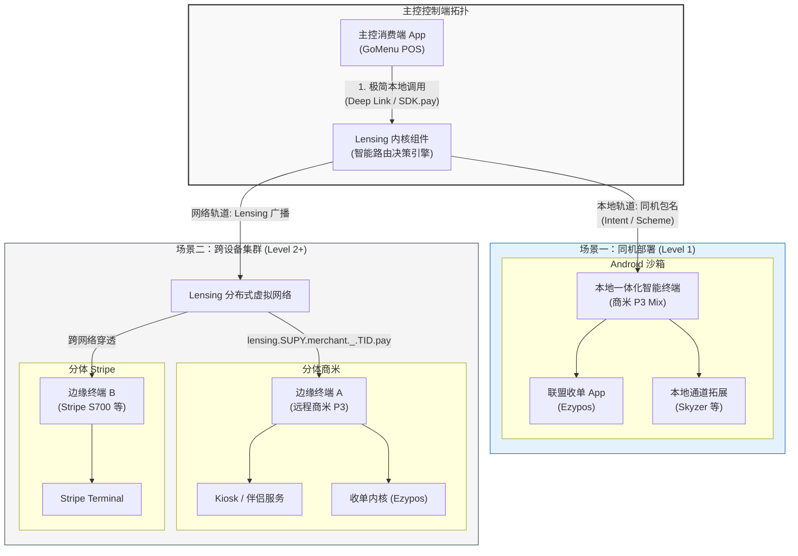
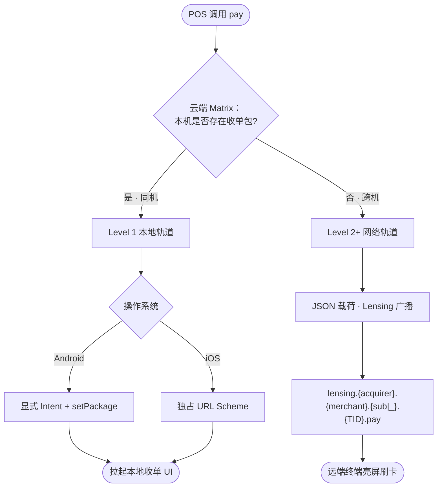

# POSRouter / Lensing 协议规范 (V1.6)

> **POSRouter** 是对外品牌、包名空间与 API 表面。
> 底层网络协议在法律与技术层面称为 **Lensing Protocol**。

| 语言 | 本文档 |
|------|--------|
| 中文 | **本页** |
| English | [README_en.md](./README_en.md) |

---

## 版本迭代历史

| 版本 | 来源 / 文档 | 主要内容 |
|------|-------------|----------|
| **V1.1** | [spec-deeplink-v1.1.pdf](./spec-deeplink-v1.1.pdf) | GoMenu ↔ Ezypos 同机 Deep Link：`connect` / `pay` / `refund` / `pay_result` 回调 |
| **V1.4** | 联盟 Lensing 整合规范 | 三层集成路线图；JSON 载荷；Lensing Subject；Gateway `/init` HMAC；全景与路由 Mermaid 图 |
| **V1.5** | **当前（Level 1）** | Level 1 新增 **`void`**、回调 **`card_number`**；规范拆分为三层独立文件；中英双语 |
| **V1.6** | **当前（Level 2）** | Lensing Subject 固定六段命名：`lensing.{acquirer}.{merchant}.{sub\|_}.{tid}.{verb}` |

> **命名说明：** 旧 README 中的「V0.4」对应规范 **V1.4**；Level 1 void / 文档重组为 **V1.5**；Lensing 六段 Subject 为 **V1.6**。

---

## 1. 概述与核心愿景

本规范定义 Starrie 联盟 **Lensing 分布式支付编排协议** 及商业准入模型，消除消费系统与收单系统集成时的底层网络复杂性。合作方可按能力由简到难渐进接入。

### 分层集成制 (Integration Levels)

| Level | 文档（中文） | 文档（English） | 说明 | SDK |
|-------|-------------|-------------------|------|-----|
| **1** | [level-1-deeplink_cn.md](./level-1-deeplink_cn.md) | [level-1-deeplink_en.md](./level-1-deeplink_en.md) | 同机 `ezypos://` / `gomenu://pay_result`；**connect / pay / refund / void** | 不需要 |
| **2** | [level-2-lensing_cn.md](./level-2-lensing_cn.md) | [level-2-lensing_en.md](./level-2-lensing_en.md) | Gateway `/init` + **Lensing**（`.pay` / `.result` / `.claimed` / **`.void`** / **`.refund`**）+ JSON | 可选 |
| **3** | [level-3-secure_cn.md](./level-3-secure_cn.md) | [level-3-secure_en.md](./level-3-secure_en.md) | Level 2 + 客户端非对称密钥、安全信封、Participant 证书 | 强烈建议 |

**升级路径：** Level 1 → 2 不破坏已有 Deep Link URL。先上线 deeplink，有跨机或 void 可靠 ack 需求再升 Level 2；生产联盟环境再升 Level 3。

**JSON Schemas：** [`schemas/`](./schemas/)

**历史参考：** [spec-deeplink-v1.1.pdf](./spec-deeplink-v1.1.pdf)（规范 **V1.1**）

---

## 2. 核心设计哲学

* **隐藏底层复杂性** — 分布式协同、心跳、状态机锁在 SDK 内核；对外呈现极简控制流。
* **数据与控制流分离** — 本地 deeplink 仅承载轻量控制元数据；对账、小票等大 payload 走 Lensing 虚拟网络通道（Level 2+）。

---

## 3. 联盟准入（全局）

* **4 位参与者代码 (Participant Code)** — 新成员须向联盟申请专属 4 位大写字母代号（例：收单 Supay `SUPY`，消费 GoMenu `GPOS`）。

---

## 4. 全景架构图（各层共用）

以下图表描述 **三层整体拓扑**，不绑定单一 Level 的实现细节；各层命令、参数与时序见对应 Level 文档。

### 4.1 Lensing 全景运行用例图

### 4.2 智能路由决策流程

> **Android SDK：** 默认 **`auto`**（本机乐观拉起 → 失败走 Lensing）。应用可通过 `RoutePreference` 字符串覆盖（如平板固定 **`remote_first`**）。详见 [Level 2 §1.1](./level-2-lensing_cn.md#11-android-sdk-路由偏好route-preference) 与 [sdk-android README](../sdk-android/README.md#route-preference)。

---

## 5. 阅读指引

| 你的目标 | 从这里开始 |
|----------|------------|
| 最快接入、同机 POS + Ezypos | [Level 1 中文](./level-1-deeplink_cn.md) |
| 跨设备、Kiosk、void ack | [Level 2 中文](./level-2-lensing_cn.md) |
| 生产联盟、非对称鉴权 | [Level 3 中文](./level-3-secure_cn.md) |
