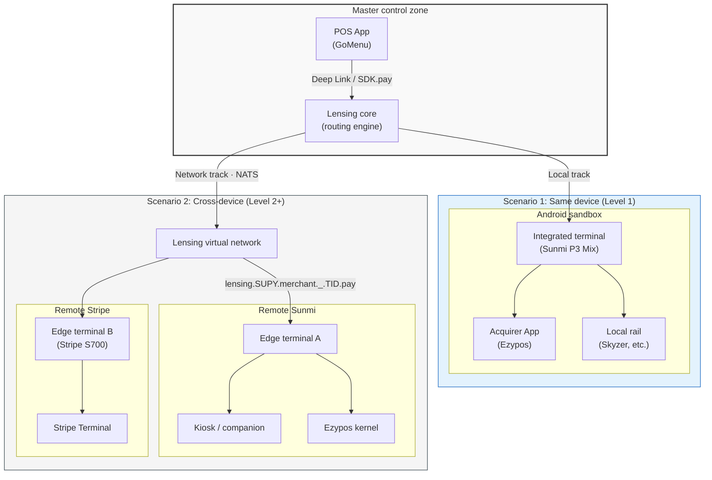
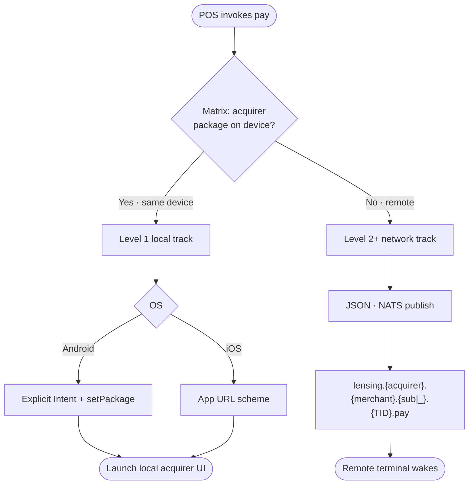

# POSRouter / Lensing Protocol Specification (V1.6)

> **POSRouter** is the outward-facing brand, package namespace, and API surface.
> The underlying networking protocol is legally and technically named the **Lensing Protocol**.

| Language | Document |
|----------|----------|
| 中文 | [README_cn.md](./README_cn.md) |
| English | **this page** |

---

## Version history

| Version | Source / document | Summary |
|---------|-------------------|---------|
| **V1.1** | [spec-deeplink-v1.1.pdf](./spec-deeplink-v1.1.pdf) | GoMenu ↔ Ezypos same-device deep links: `connect` / `pay` / `refund` / `pay_result` callback |
| **V1.4** | Alliance Lensing consolidated spec | Three integration levels; JSON payloads; NATS subjects; Gateway `/init` HMAC; panorama & routing diagrams |
| **V1.5** | Level 1 **`void`**, callback **`card_number`**, split per-level docs, bilingual |
| **V1.6** | **Current (Level 2)** | Fixed 6-segment NATS subjects: `lensing.{acquirer}.{merchant}.{sub|_}.{tid}.{verb}` |

> **Naming note:** Former README “V0.4” → spec **V1.4**; Level 1 void / doc split → **V1.5**; fixed 6-segment NATS subjects → **V1.6**.

---

## 1. Overview

This specification defines the Starrie **Lensing distributed payment orchestration protocol** and alliance onboarding model. Partners integrate progressively from the simplest layer upward.

### Integration levels

| Level | 中文 | English | Summary | SDK |
|-------|------|---------|---------|-----|
| **1** | [level-1-deeplink_cn.md](./level-1-deeplink_cn.md) | [level-1-deeplink_en.md](./level-1-deeplink_en.md) | Same-device `ezypos://` / `gomenu://pay_result`; **connect / pay / refund / void** | Not required |
| **2** | [level-2-lensing_cn.md](./level-2-lensing_cn.md) | [level-2-lensing_en.md](./level-2-lensing_en.md) | Gateway `/init` + NATS (`.pay` / `.result` / `.claimed` / **`.void`**) + JSON | Optional |
| **3** | [level-3-secure_cn.md](./level-3-secure_cn.md) | [level-3-secure_en.md](./level-3-secure_en.md) | Level 2 + client asymmetric keys, secure envelopes, Participant certificates | Strongly recommended |

**Upgrade path:** Level 1 → 2 does not break existing deep link URLs. Ship deeplink first; add NATS for cross-device or reliable void ack; adopt Level 3 for production alliance trust.

**JSON Schemas:** [`schemas/`](./schemas/)

**Historical reference:** [spec-deeplink-v1.1.pdf](./spec-deeplink-v1.1.pdf) (spec **V1.1**)

---

## 2. Design principles

* **Hide complexity** — Distributed coordination, heartbeats, and state machines live inside the SDK; the public surface stays minimal.
* **Separate control from data** — Local deeplinks carry lightweight control metadata; reconciliation and receipt payloads use the Lensing virtual network (Level 2+).

---

## 3. Alliance onboarding (global)

* **4-letter Participant Code** — New members must obtain a unique uppercase code from the alliance (e.g. acquirer Supay `SUPY`, POS GoMenu `GPOS`).

---

## 4. Panorama diagrams (all levels)

These diagrams describe the **overall three-level topology**. Command details and sequences live in each level document.

### 4.1 Lensing panorama

### 4.2 Routing decision flow

---

## 5. Where to start

| Goal | Start here |
|------|------------|
| Fastest onboarding, same-device POS + Ezypos | [Level 1 English](./level-1-deeplink_en.md) |
| Cross-device, kiosk, void ack | [Level 2 English](./level-2-lensing_en.md) |
| Production alliance, asymmetric auth | [Level 3 English](./level-3-secure_en.md) |
