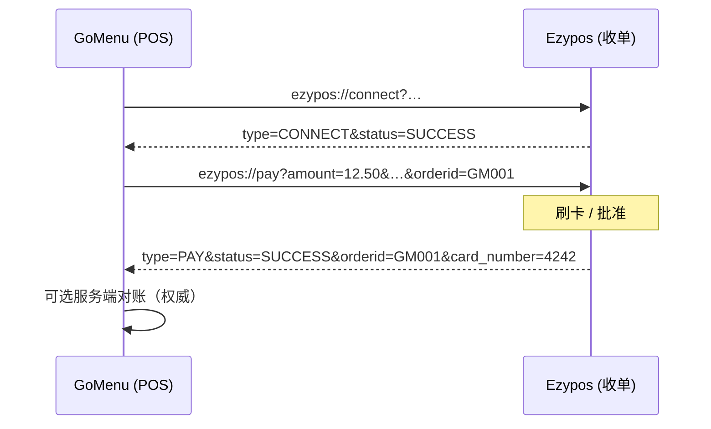
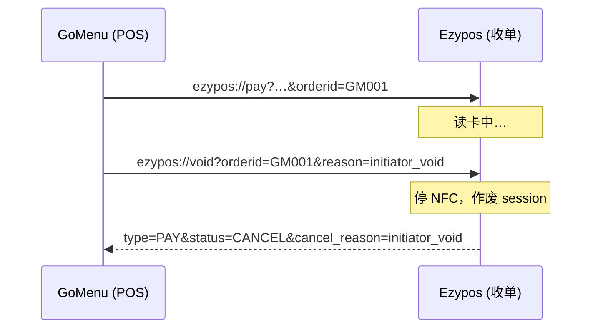

# Level 1 — 同机 Deep Link 集成 (V1.5)

| 语言 | 文档 |
|------|------|
| 中文 | **本页** |
| English | [level-1-deeplink_en.md](./level-1-deeplink_en.md) |

> **适用对象：** 同机部署的 POS / 点餐 App（如 GoMenu）与收单 App（如 Ezypos），**无需** POSRouter SDK。
>
> **规范沿革：** 自 [spec-deeplink-v1.1.pdf](./spec-deeplink-v1.1.pdf)（**规范 V1.1**）演进。本文为联盟 **V1.5** 的 **Level 1** 正式规范（含 **`void`**、**`card_number`**、`attemptid`、与 SDK 一致的编码规则）。

**总览：** [README_cn.md](./README_cn.md) · **Level 2：** [level-2-lensing_cn.md](./level-2-lensing_cn.md)

---

## 1. 设计原则

1. **弱耦合** — 纯 URL 文本与标准 Android Intent；POS 与收单端之间无需共享二进制 SDK。
2. **回调 = 唤醒 + 状态提示** — 反向 deeplink 通知 POS 刷新界面；**权威结算**仍以服务端为准。
3. **单一 session 真相（收单端）** — 所有命令（`pay`、`void`、`refund`）经 **`orderid`**（+ 可选 **`attemptid`**）绑定的支付 session 路由。
4. **显式包名** — 调用方 SHOULD 使用 `Intent.setPackage(acquirerPackageName)`，避免 scheme 被抢占。

---

## 2. URL Scheme 约定

### 2.1 收单端入站（POS → Ezypos）

| 路由 | Scheme URI | 用途 |
|------|------------|------|
| Connect | `ezypos://connect?…` | 注册商户与回调 URL |
| Pay | `ezypos://pay?…` | 发起支付 |
| Refund | `ezypos://refund?…` | 退款 |
| **Void** | **`ezypos://void?…`** | 主叫方作废进行中的支付（非用户在收单 UI 内按取消） |

默认 scheme：**`ezypos`**。联盟目录可映射其他收单（如 `skyzer://pay`）。

### 2.2 POS 回调（Ezypos → POS）

| Scheme URI | 用途 |
|------------|------|
| connect 时注册的 `{callback_url}` | 异步结果通知 |

GoMenu 约定：

```text
gomenu://pay_result?type=PAY&status=SUCCESS&orderid=GM001&card_number=4242
```

固定 host **`pay_result`** 与 query 结构；仅 scheme 前缀（`gomenu`）因 POS 品牌而异。

---

## 3. 参数编码

### 3.1 Query 分隔符

| 配置 | 分隔符 | 使用方 |
|------|--------|--------|
| **Legacy（Ezypos 默认）** | `&` | 当前 Ezypos 生产版本 |
| **Lens pipe** | `\|` | POSRouter SDK 默认 |

**规则：** Level 1 认证收单端 MUST 接受 **`&`**；联盟矩阵声明时 SHOULD 接受 **`|`**。

### 3.2 值编码（`LensLocalEncoder`）

结构破坏字符须编码：`%`→`%25`，`=`→`%3D`，`?`→`%3F`，空格→`%20`，`|`→`%7C`，`&`→`%26`。须通过 `Uri` / `Intent.setData` 构建 URL。

### 3.3 金额格式

十进制字符串，**两位小数**，点分隔（主货币单位）：`"12.50"`、`"666.66"`。

---

## 4. Android 投递方式

### 4.1 Deep Link（推荐）

```kotlin
val uri = Uri.parse("ezypos://pay?amount=12.50&currency=NZD&orderid=GM001")
val intent = Intent(Intent.ACTION_VIEW, uri).apply {
    addCategory(Intent.CATEGORY_BROWSABLE)
    addFlags(Intent.FLAG_ACTIVITY_NEW_TASK)
    setPackage("ezypay.com.globe.cardpos")
}
startActivity(intent)
```

**收单 Manifest** — 统一路由 Activity，`singleTask`，注册 `connect` / `pay` / `void` / `refund` 四个 host。

### 4.2 显式 Intent + `LENS_DATA`

`LENS_DATA` 为 `key=value` 键值串，分隔符与 deeplink 一致；键名与 query 参数相同。

---

## 5. 命令（POS → 收单端）

### 5.1 Connect — `ezypos://connect`

| 参数 | 必填 | 说明 |
|------|------|------|
| `merchantid` | ✓ | 商户 / partner code |
| `callback_url` | ✗ | URL 编码的反向 deeplink；空则清除绑定 |
| `key` | ✗ | 保留（Level 2+ 鉴权） |

可选立即回调：`gomenu://pay_result?type=CONNECT&status=SUCCESS`

### 5.2 Pay — `ezypos://pay`

| 参数 | 必填 | 说明 |
|------|------|------|
| `amount` | ✓ | 金额（§3.3） |
| `currency` | ✓ | ISO 4217 |
| `orderid` | ✓ | POS 唯一订单号 |
| `method` | ✗ | `emv_card`、`show_qr_code`、`scan_code` |
| `remark` | ✗ | 展示 / 小票备注 |
| `attemptid` | ✗ | 支付尝试 id（与 Level 2 对齐；默认 `{orderid}#1`） |
| `callback_url` | ✗ | 覆盖 connect 时注册的回调 |

收单端：创建/恢复 session；若已完成则 `DUPLICATE_ORDER_ID`；终态时反向回调（§6）。

### 5.3 Void — `ezypos://void` *(V1.5)*

主叫方 **作废支付请求**，不同于用户在 Ezypos 内按取消。

| 参数 | 必填 | 说明 |
|------|------|------|
| `orderid` | ✓ | 目标订单 |
| `attemptid` | ✗ | 目标尝试（与 Level 2 联用时建议填写） |
| `reason` | ✗ | 默认 `initiator_void` |

**收单端行为：** 按 session 解析；活跃则停 NFC、置 `VOIDED`、复位 UI；已完成则忽略；可选回调 `cancel_reason=initiator_void`。

跨机 void ack 见 [Level 2](./level-2-lensing_cn.md) Lensing **`.void`**；同机仍须 `ezypos://void` 释放硬件。

### 5.4 Refund — `ezypos://refund`

| 参数 | 必填 |
|------|------|
| `amount` | ✓ |
| `orderid` | ✓（原支付订单） |

回调：`type=REFUND`，`status=SUCCESS|FAIL|CANCEL`。

---

## 6. 反向回调（收单端 → POS）

### 6.1 参数

| 参数 | 必填 | 说明 |
|------|------|------|
| `type` | ✓ | `PAY`、`REFUND`、`CONNECT` |
| `status` | ✓ | 见 §6.2 |
| `orderid` | ✗ | `PAY` / `REFUND` 时必填 |
| `transactionid` | ✗ | 批准时的收单流水号 |
| **`card_number`** | ✗ | **卡支付成功时返回卡号末四位（或掩码尾段），供 POS 展示或小票打印 *(V1.5)* ** |
| `cancel_reason` | ✗ | `user_cancel` \| `initiator_void` |
| `attemptid` | ✗ | 回显 pay 请求 |

JSON schema：[`schemas/deeplink-callback.json`](./schemas/deeplink-callback.json)

**`card_number` 规则：**

- 在 `type=PAY` + `status=SUCCESS` 且为卡支付、能取得卡号时返回。
- 一般为 **4 位数字**（如 `4242`）；联盟矩阵可要求掩码形式 `****4242`。
- QR 支付、connect、取消、拒绝或无法取得时省略。
- POS 仅用于展示/打印，**不得**将回调当作 PAN 的权威来源。

### 6.2 状态值

**`type=PAY`：** `SUCCESS`、`FAIL`、`CANCEL`、`DUPLICATE_ORDER_ID`

**`type=REFUND`：** `SUCCESS`、`FAIL`、`CANCEL`

**`type=CONNECT`：** `SUCCESS`、`FAIL`

### 6.3 示例

```text
gomenu://pay_result?type=PAY&status=SUCCESS&orderid=GM20260602001&transactionid=TXN123&card_number=4242
gomenu://pay_result?type=PAY&status=CANCEL&orderid=GM20260602001&cancel_reason=initiator_void
gomenu://pay_result?type=CONNECT&status=SUCCESS
```

### 6.4 POS Manifest

注册 `gomenu` + host `pay_result`；在 `onCreate` / `onNewIntent` 处理并清除 intent。

---

## 7. 端到端时序

### 7.1 支付成功



### 7.2 主叫 void（同机）



---

## 8. 收单 session 模型

`PaymentGatewayActivity (singleTask)` → `PaymentSessionRegistry`：`ACTIVE` / `VOIDED` / `COMPLETED`。

收单端可延后实现 `ezypos://void`；未实现前 Level 1 仅支持用户在 Ezypos 内取消。

---

## 9. Level 1 能力边界

| 能力 | Level 1 | Level 2+ |
|------|---------|----------|
| 跨机支付 | ✗ | Lensing `.pay` |
| 主叫 void + 终端 ack | 仅可选回调 | Lensing `.void` + `.result` |
| `attemptId` 去重 | 可选 | JSON 必填 |
| Gateway `/init` | 不用 | 需要 |
| 加密信封 | ✗ | Level 3 |

---

## 10. 认证清单

**POS：** connect → pay；成功回调解析 **`card_number`**；支持 void（收单就绪后）；所有收单 Intent 使用 `setPackage`。

**收单：** `singleTask` 网关；按 `orderid` 管理 session；各终态均回调；void 停 NFC；接受 `&` 分隔符。

---

## 11. 文档历史

| 版本 | 变更 |
|------|------|
| V1.1 (PDF) | connect / pay / refund / callback |
| V1.5 (本文) | **`void`**；**`card_number`**；`attemptid`；`cancel_reason`；`LENS_DATA`；独立 Level 1 规范 |

参考 PDF：[spec-deeplink-v1.1.pdf](./spec-deeplink-v1.1.pdf)
