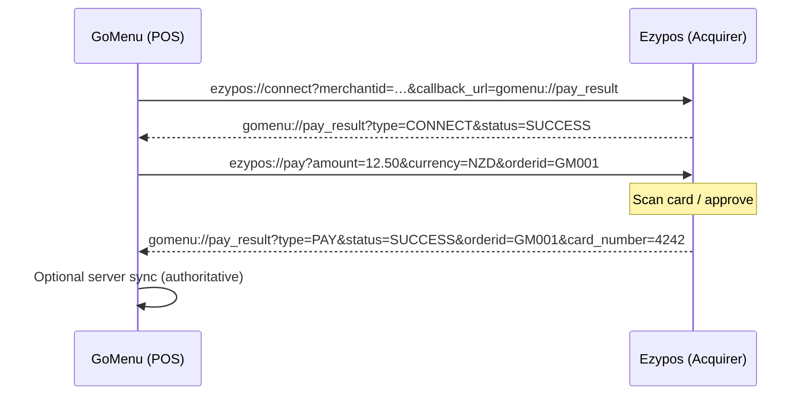
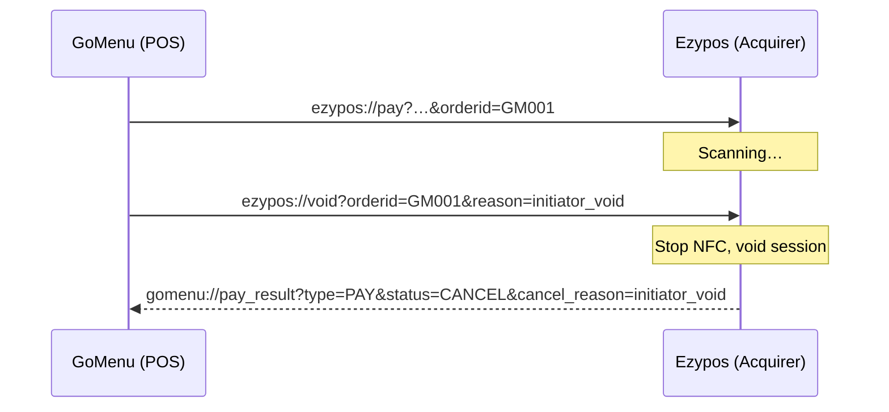

# Level 1 — Local Deep Link Integration (V1.5)

| Language | Document |
|----------|----------|
| 中文 | [level-1-deeplink_cn.md](./level-1-deeplink_cn.md) |
| English | **this page** |

> **Audience:** POS / ordering apps (e.g. GoMenu) and acquirer apps (e.g. Ezypos) integrating **on the same Android device** without POSRouter SDK.
>
> **Normative lineage:** Evolved from [spec-deeplink-v1.1.pdf](./spec-deeplink-v1.1.pdf) (**spec V1.1**). This document is the canonical **Level 1** spec for alliance **V1.5** (`void`, `card_number`, `attemptid`, SDK-aligned encoding).

**Framework overview:** [README_en.md](./README_en.md) · **Level 2:** [level-2-lensing_en.md](./level-2-lensing_en.md)

---

## 1. Design principles

1. **Weak coupling** — Plain URL text and standard Android Intents; no shared binary SDK between POS and acquirer.
2. **Callback = wake + state hint** — The reverse deeplink notifies the POS to refresh UI. **Authoritative settlement** remains server-side where applicable.
3. **Single session truth (acquirer)** — Route all commands (`pay`, `void`, `refund`) through a **payment session** keyed by `orderid` (+ optional `attemptid`).
4. **Explicit package targeting** — Callers SHOULD use `Intent.setPackage(acquirerPackageName)` to avoid scheme hijacking.

---

## 2. URL scheme conventions

### 2.1 Acquirer inbound (POS → Ezypos)

| Route | Scheme URI | Purpose |
|-------|------------|---------|
| Connect | `ezypos://connect?…` | Register merchant + callback URL |
| Pay | `ezypos://pay?…` | Start a payment |
| Refund | `ezypos://refund?…` | Refund a prior payment |
| **Void** | **`ezypos://void?…`** | Initiator aborts in-flight pay (not user cancel in acquirer UI) |

Default scheme: **`ezypos`**. Alliance registry may map other acquirers (e.g. `skyzer://pay`).

### 2.2 POS callback (Ezypos → POS)

| Scheme URI | Purpose |
|------------|---------|
| `{callback_url}` registered at connect | Async result notification |

GoMenu convention:

```text
gomenu://pay_result?type=PAY&status=SUCCESS&orderid=GM001&card_number=4242
```

Host **`pay_result`** and query shape are fixed; only the scheme prefix (`gomenu`) may vary per POS brand.

---

## 3. Parameter encoding

### 3.1 Query delimiter profiles

| Profile | Delimiter | Used by |
|---------|-----------|---------|
| **Legacy (Ezypos default)** | `&` | Current Ezypos production builds |
| **Lens pipe** | `\|` | POSRouter SDK default |

**Rule:** Acquirer MUST accept **`&`** for Level 1 certification. **`|`** SHOULD be accepted when documented in alliance matrix.

### 3.2 Value encoding (`LensLocalEncoder`)

| Character | Encoded |
|-----------|---------|
| `%` | `%25` (first) |
| `=` | `%3D` |
| `?` | `%3F` |
| space | `%20` |
| `\|` | `%7C` |
| `&` | `%26` |

Use `Uri` / `Intent.setData` — do not hand-build without encoding.

### 3.3 Amount format

Decimal string, **two fractional digits**, dot separator (major currency units): `"12.50"`, `"666.66"`.

---

## 4. Android delivery

### 4.1 Deep Link (recommended)

```kotlin
val uri = Uri.parse("ezypos://pay?amount=12.50&currency=NZD&orderid=GM001")
val intent = Intent(Intent.ACTION_VIEW, uri).apply {
    addCategory(Intent.CATEGORY_BROWSABLE)
    addFlags(Intent.FLAG_ACTIVITY_NEW_TASK)
    setPackage("ezypay.com.globe.cardpos")
}
startActivity(intent)
```

**Manifest (acquirer)** — unified router, `singleTask`:

```xml
<activity android:name=".PaymentGatewayActivity" android:launchMode="singleTask" android:exported="true">
    <intent-filter>
        <action android:name="android.intent.action.VIEW" />
        <category android:name="android.intent.category.DEFAULT" />
        <category android:name="android.intent.category.BROWSABLE" />
        <data android:scheme="ezypos" android:host="pay" />
    </intent-filter>
    <intent-filter><data android:scheme="ezypos" android:host="connect" /></intent-filter>
    <intent-filter><data android:scheme="ezypos" android:host="void" /></intent-filter>
    <intent-filter><data android:scheme="ezypos" android:host="refund" /></intent-filter>
</activity>
```

### 4.2 Explicit Intent + `LENS_DATA`

```kotlin
val lensData = "amount=12.50|currency=NZD|orderid=GM001|method=emv_card|callback_url=gomenu://pay_result"
val intent = Intent(Intent.ACTION_MAIN).apply {
    setPackage("ezypay.com.globe.cardpos")
    addCategory(Intent.CATEGORY_LAUNCHER)
    putExtra("LENS_DATA", lensData)
    addFlags(Intent.FLAG_ACTIVITY_NEW_TASK)
}
startActivity(intent)
```

---

## 5. Commands (POS → Acquirer)

### 5.1 Connect — `ezypos://connect`

| Parameter | Required | Description |
|-----------|----------|-------------|
| `merchantid` | ✓ | Merchant / partner code |
| `callback_url` | ✗ | URL-encoded reverse deeplink; empty clears binding |
| `key` | ✗ | Reserved (Level 2+ auth) |

```text
ezypos://connect?merchantid=abc123&callback_url=gomenu%3A%2F%2Fpay_result
```

Optional immediate callback: `gomenu://pay_result?type=CONNECT&status=SUCCESS`

### 5.2 Pay — `ezypos://pay`

| Parameter | Required | Description |
|-----------|----------|-------------|
| `amount` | ✓ | Decimal amount (§3.3) |
| `currency` | ✓ | ISO 4217 |
| `orderid` | ✓ | POS unique order id |
| `method` | ✗ | `emv_card`, `show_qr_code`, `scan_code` |
| `remark` | ✗ | Display / receipt hint |
| `attemptid` | ✗ | Payment try id (Level 2 alignment; default `{orderid}#1`) |
| `callback_url` | ✗ | Override connect-time callback |

```text
ezypos://pay?amount=666.66&currency=NZD&orderid=GM20260602001&remark=Table%205&method=emv_card
```

1. Create or resume `PaymentSession(orderid, attemptid)`.
2. If **completed** → `status=DUPLICATE_ORDER_ID` (or ignore per policy).
3. Launch payment UI; on outcome → reverse callback (§6).

### 5.3 Void — `ezypos://void` *(V1.5)*

POS **voids the payment request** — not the same as user pressing Cancel inside Ezypos.

| Parameter | Required | Description |
|-----------|----------|-------------|
| `orderid` | ✓ | Target order |
| `attemptid` | ✗ | Target try (recommended with Level 2) |
| `reason` | ✗ | Default `initiator_void` |

```text
ezypos://void?orderid=GM20260602001&attemptid=GM20260602001%231&reason=initiator_void
```

**Acquirer behaviour:**

1. Resolve session by `(orderid, attemptid)` — no unrelated “void wizard” Activity.
2. If **active**: stop NFC / reader, session → `VOIDED`, reset UI.
3. If **idle / unknown** → no-op.
4. If **completed** → ignore.
5. Optional callback: `gomenu://pay_result?type=PAY&status=CANCEL&orderid=…&cancel_reason=initiator_void`

> Cross-device void ack: [Level 2](./level-2-lensing_en.md) NATS `.void` + `.result`. Ezypos void deeplink still required to **stop hardware**.

### 5.4 Refund — `ezypos://refund`

| Parameter | Required |
|-----------|----------|
| `amount` | ✓ |
| `orderid` | ✓ (original pay) |

Callback: `type=REFUND`, `status=SUCCESS|FAIL|CANCEL`.

---

## 6. Reverse callback (Acquirer → POS)

```text
{scheme}://pay_result?type={TYPE}&status={STATUS}&orderid={ORDERID}
```

### 6.1 Parameters

| Parameter | Required | Description |
|-----------|----------|-------------|
| `type` | ✓ | `PAY`, `REFUND`, `CONNECT` |
| `status` | ✓ | See §6.2 |
| `orderid` | ✗ | Required for `PAY` / `REFUND` |
| `transactionid` | ✗ | Acquirer txn reference when approved |
| **`card_number`** | ✗ | Last 4 digits (or masked tail) on approved card pay; for POS receipt / UI *(V1.5)* |
| `cancel_reason` | ✗ | `user_cancel` \| `initiator_void` |
| `attemptid` | ✗ | Echo from pay request |

JSON schema: [`schemas/deeplink-callback.json`](./schemas/deeplink-callback.json)

**`card_number` rules:**

- Present on `type=PAY` + `status=SUCCESS` when payment method is card and digits are available.
- Typically **4 digits** (e.g. `4242`); MAY be masked form `****4242` if alliance matrix requires.
- Omit for QR, connect-only, cancel, decline, or when acquirer cannot determine card tail.
- POS MUST NOT treat callback as sole proof of PAN — display / print only; settlement remains server-side.

### 6.2 Status values

**`type=PAY`:** `SUCCESS`, `FAIL`, `CANCEL`, `DUPLICATE_ORDER_ID`

**`type=REFUND`:** `SUCCESS`, `FAIL`, `CANCEL`

**`type=CONNECT`:** `SUCCESS`, `FAIL`

### 6.3 Examples

```text
gomenu://pay_result?type=PAY&status=SUCCESS&orderid=GM20260602001&transactionid=TXN123&card_number=4242
gomenu://pay_result?type=PAY&status=CANCEL&orderid=GM20260602001&cancel_reason=user_cancel
gomenu://pay_result?type=PAY&status=CANCEL&orderid=GM20260602001&cancel_reason=initiator_void
gomenu://pay_result?type=CONNECT&status=SUCCESS
```

### 6.4 POS Manifest (GoMenu)

```xml
<intent-filter>
    <action android:name="android.intent.action.VIEW" />
    <category android:name="android.intent.category.DEFAULT" />
    <category android:name="android.intent.category.BROWSABLE" />
    <data android:scheme="gomenu" android:host="pay_result" />
</intent-filter>
```

Handle in `onCreate` / `onNewIntent`; clear intent after handling.

---

## 7. End-to-end flows

### 7.1 Happy path (pay)



### 7.2 Initiator void (same device)



---

## 8. Acquirer session model

```text
PaymentGatewayActivity (singleTask)
        │
        ▼
PaymentSessionRegistry
        ├── ACTIVE    → pay UI, NFC on
        ├── VOIDED    → hardware off, ignore late events
        └── COMPLETED → ignore duplicate pay/void
```

Partners MAY defer `ezypos://void` until a later release; until then only user cancel inside Ezypos ends the flow at Level 1.

---

## 9. Level 1 limitations

| Capability | Level 1 | Level 2+ |
|------------|---------|----------|
| Cross-device pay | ✗ | NATS `.pay` |
| Initiator void with terminal ack | Optional callback | NATS `.void` + `.result` |
| `attemptId` dedupe | Optional | Required in wire JSON |
| Gateway `/init` | Not used | Required |
| Signed envelopes | ✗ | Level 3 |

---

## 10. Certification checklist

**POS:** connect → pay; callback + `card_number` on success; `void` when supported; `setPackage` on all acquirer intents.

**Acquirer:** `singleTask` gateway; session by `orderid`; pay callbacks on all terminal states; void stops NFC; accepts `&` delimiter.

---

## 11. Document history

| Version | Change |
|---------|--------|
| V1.1 (PDF) | connect / pay / refund / callback |
| V1.5 (this doc) | **`void`**; **`card_number`**; `attemptid`; `cancel_reason`; `LENS_DATA`; split Level 1 spec |

Reference PDF: [spec-deeplink-v1.1.pdf](./spec-deeplink-v1.1.pdf)
