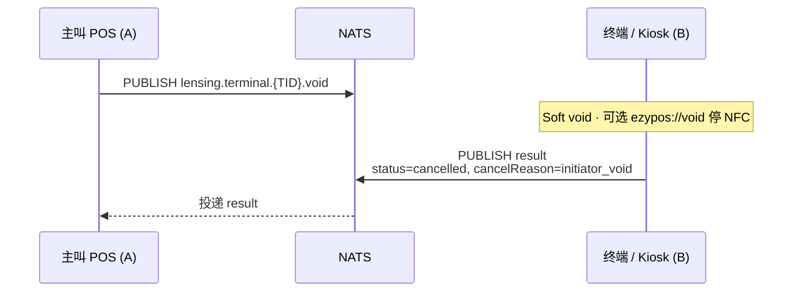
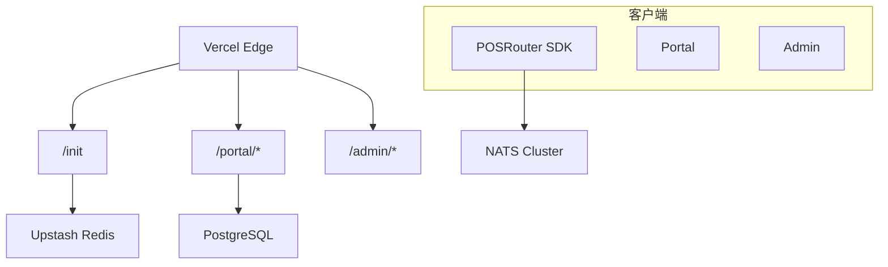
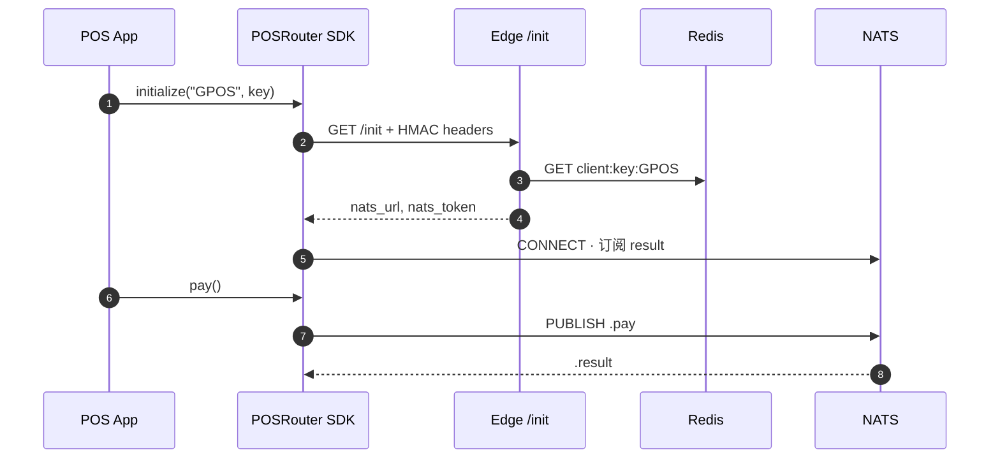
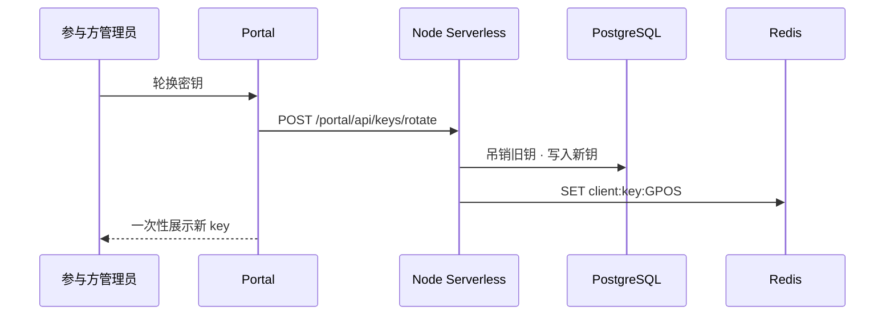
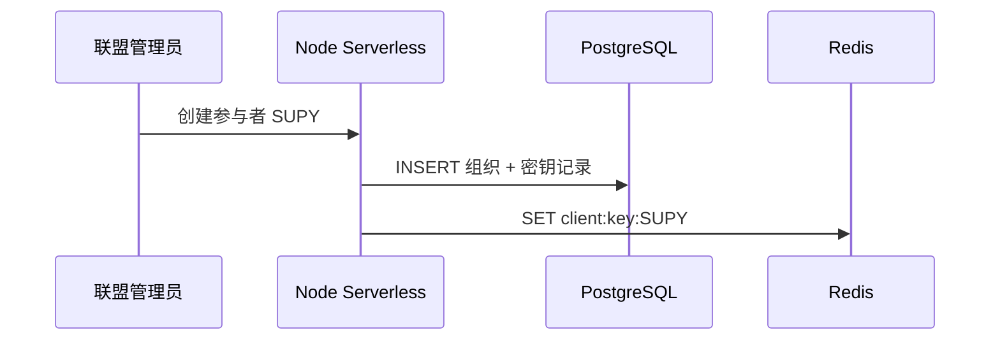

# Level 2 — Lensing 有线协议 (JSON / NATS) (V1.5)

| 语言 | 文档 |
|------|------|
| 中文 | **本页** |
| English | [level-2-lensing_en.md](./level-2-lensing_en.md) |

> **适用对象：** 需要 **跨设备** 路由、Kiosk 监听、`attemptId` 去重、以及 NATS 上可靠 **void ack** 的合作方。SDK 可选，建议使用。
>
> **前置：** [Level 1](./level-1-deeplink_cn.md) Deep Link 仍可作为同机回退路径。

**总览：** [README_cn.md](./README_cn.md) · **Level 3：** [level-3-signed_cn.md](./level-3-signed_cn.md)

---

## 1. 范围

Level 2 在 Level 1 之上增加：

- Gateway `/init` HMAC 握手 → NATS 凭证
- NATS 上的 JSON `PaymentRequest` / `PaymentResult`
- Subject：`.pay`、`.result`、`.claimed`、**`.void`**
- SDK 状态机与断线重连队列

Level 1 同机 URL 不变；SDK 检测到本机收单包时可走本地轨道。

---

## 2. NATS Subject 路由

| 方向 | Subject 模式 | 说明 |
|------|-------------|------|
| POS → Terminal | `lensing.terminal.{TID}.pay` | 支付请求广播 |
| POS → Terminal | `lensing.terminal.{TID}.void` | 主叫作废整笔 attempt（非用户在收单 UI 取消） |
| Terminal → POS | `lensing.terminal.{TID}.result` | 支付结果 / void ack（`metadata.cancelReason=initiator_void`） |
| Terminal ↔ Terminal | `lensing.terminal.{TID}.claimed` | UI 抢占（SDK 内部，可选） |

**Level 1 对照：** 同机 void 用 `ezypos://void?…`，见 [Level 1 §5.3](./level-1-deeplink_cn.md#53-void--ezyposvoid-v15)。

`{TID}` 为联盟 Matrix 注册的终端号。

---

## 3. PaymentRequest JSON

> Level 1 同机字段：[Level 1 §5](./level-1-deeplink_cn.md#5-命令pos--收单端)。

Schema：[`schemas/payment-request.json`](./schemas/payment-request.json)

```json
{
  "terminalId": "TID001",
  "orderId": "GM20260602001",
  "attemptId": "GM20260602001#1",
  "amount": 1250,
  "currency": "USD",
  "targetPackageName": "com.ezypos.app",
  "targetScheme": "ezypos://",
  "metadata": {}
}
```

| 字段 | 类型 | 必填 | 说明 |
|------|------|------|------|
| `terminalId` | string | ✓ | 目标终端 |
| `orderId` | string | ✓ | POS 订单号（Level 1 `orderid`） |
| `attemptId` | string | ✓ | 去重键；默认 `{orderId}#1` |
| `amount` | integer | ✓ | 最小货币单位（分） |
| `currency` | string | ✓ | ISO 4217 |
| `targetPackageName` | string | Android | 本地轨道包名 |
| `targetScheme` | string | iOS | 本地轨道 scheme |
| `metadata` | object | ✗ | 扩展 |

---

## 4. PaymentResult JSON

> Level 1 回调 query：[Level 1 §6](./level-1-deeplink_cn.md#6-反向回调收单端--pos)（成功时 **`card_number`**）。

Schema：[`schemas/payment-result.json`](./schemas/payment-result.json)

```json
{
  "terminalId": "TID001",
  "orderId": "GM20260602001",
  "attemptId": "GM20260602001#1",
  "status": "approved",
  "transactionId": "txn_abc123",
  "amount": 1250,
  "currency": "USD",
  "message": "Payment approved",
  "metadata": {
    "cancelReason": "initiator_void",
    "cardLast4": "4242"
  }
}
```

| `status` | 说明 |
|----------|------|
| `approved` | 成功 |
| `declined` | 拒绝 |
| `cancelled` | 用户取消或主叫 void — 见 `metadata.cancelReason` |
| `error` | 系统错误 |

| `metadata` 键 | 时机 | Level 1 对应 |
|----------------|------|--------------|
| `cancelReason` | `cancelled` | `cancel_reason` |
| `cardLast4` | 卡支付 `approved` | `card_number` |

---

## 5. Void 有线时序



| `cancelReason` | 来源 |
|----------------|------|
| `user_cancel` | 用户在收单 UI 取消 |
| `initiator_void` | 主叫 void（deeplink 或 NATS） |

---

## 6. Gateway 认证（V1.4 对称 HMAC — 现行）

> **路线：** 维持对称 HMAC 直至 Level 3 非对称模型落地；跳过 V1 中间态。终态见 [Level 3](./level-3-signed_cn.md)。

```
GET https://lensing.starrie.org/init?code=GPOS
Headers:
  X-PR-Timestamp: <unix_ms>
  X-PR-Signature: HmacSHA256(key + timestamp)
```

成功响应：

```json
{
  "nats_url": "nats://router.starrie.org:4222",
  "nats_token": "TOKEN_GPOS_<SECRET_SALT>"
}
```

| 项目 | 行为 |
|------|------|
| SDK 持有 | 对称密钥 `key`（Keychain / Keystore） |
| Redis | `client:key:{CODE}` = 明文 `key` |
| 传输 | **不传** `key`；仅 timestamp + signature |
| 签名 | `HMAC-SHA256(key, key + timestamp)` → hex |

---

## 7. Lensing 内核状态机

| 状态 | 说明 |
|------|------|
| `IDLE` | 未初始化 |
| `DISCOVERING` | 向 Gateway 请求 NATS 凭证 |
| `CONNECTING` | 建立 NATS 连接 |
| `CONNECTED` | 可收发 |
| `RECONNECTING` | 指数退避重连 |
| `FAILED` | 不可恢复错误 |

断线时出站消息入本地队列，重连后 flush。

---

## 8. Gateway 运行时架构

联盟 Gateway 部署于 Vercel：**Edge** 处理 `/init`，**Node Serverless** 处理 Portal / Admin。

### 8.1 执行环境

| | Edge Function | Node.js Serverless |
|--|---------------|-------------------|
| 位置 | 全球 CDN 边缘 | 区域数据中心 |
| 冷启动 | 极快 | 较慢 |
| 典型路由 | `/init` | `/admin/*`、`/portal/*` |

### 8.2 请求拓扑



### 8.3 路由映射

| URL | Runtime | 职责 |
|-----|---------|------|
| `GET /init` | `edge` | HMAC 鉴权、签发 NATS token |
| `/portal/*` | `nodejs22.x` | 参与方自助、密钥轮换 |
| `/admin/*` | `nodejs22.x` | 联盟管理、成员激活 |

---

## 9. 时序：SDK 初始化 → NATS



---

## 10. 时序：对称密钥轮换



### 10.1 超级管理：激活成员



### 10.2 存储职责

| 数据 | PostgreSQL | Redis |
|------|------------|-------|
| 组织 / 用户 | ✓ | — |
| 密钥轮换审计 | ✓ | 当前 active key |
| `/init` 热路径（V1.4 HMAC） | — | `client:key:{CODE}` |
| `/init` 热路径（Level 3） | 公钥归档 | `client:pubkey:{CODE}` |

非对称存储详见 [Level 3 §4](./level-3-signed_cn.md)。

---

## 11. Level 2 能力边界

| 能力 | Level 2 | Level 3 |
|------|---------|---------|
| 不可抵赖 | ✗ | Ed25519 签名 `/init` |
| 私钥不出设备 | ✗（对称 key） | ✓ |
| Participant 证书 | ✗ | ✓ |

---

## 12. 文档历史

| 版本 | 变更 |
|------|------|
| V1.4 | NATS、JSON Schema、Gateway HMAC、状态机、Portal 轮换 |
| V1.5 | **`.void`**；`metadata.cancelReason`；`cardLast4`；独立 Level 2 文档 |
