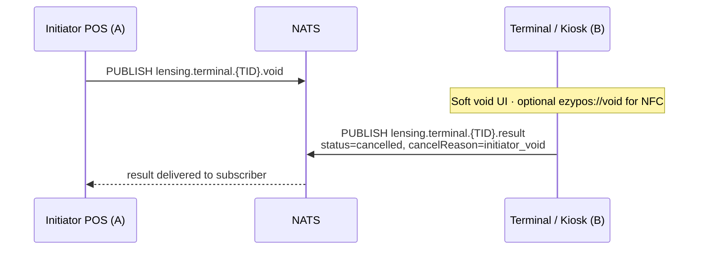
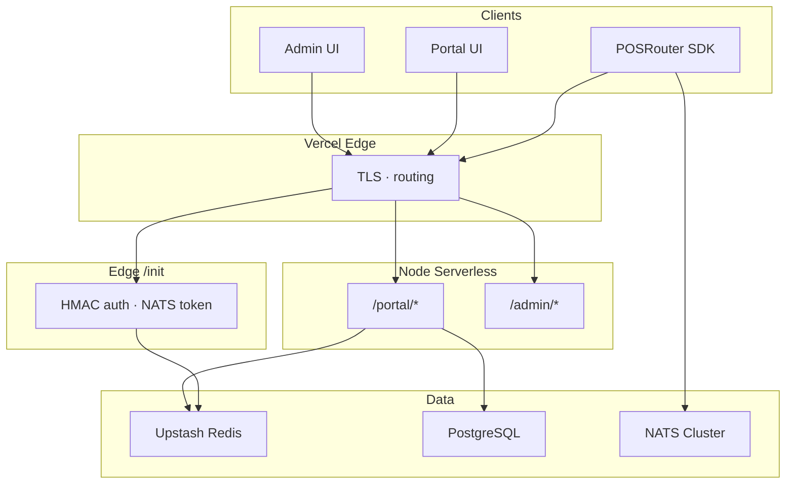
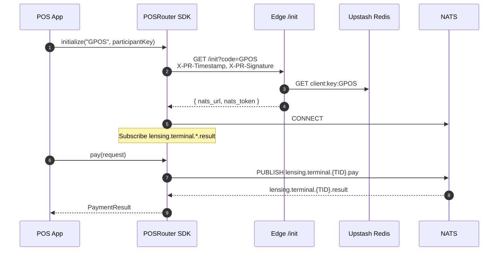
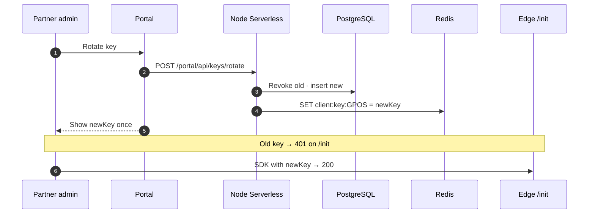
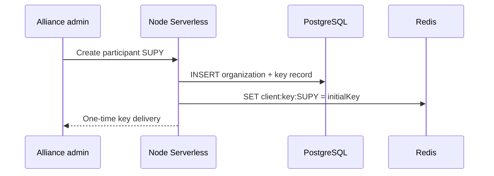

# Level 2 — Lensing Wire (JSON / NATS) (V1.5)

| Language | Document |
|----------|----------|
| 中文 | [level-2-lensing_cn.md](./level-2-lensing_cn.md) |
| English | **this page** |

> **Audience:** Partners needing **cross-device** routing, kiosk listeners, `attemptId` dedupe, and reliable **void ack** over NATS. SDK optional but recommended.
>
> **Prerequisite:** [Level 1](./level-1-deeplink_en.md) deep links remain valid for same-device fallback.

**Framework:** [README_en.md](./README_en.md) · **Level 3:** [level-3-signed_en.md](./level-3-signed_en.md)

---

## 1. Scope

Level 2 adds:

- Gateway `/init` HMAC handshake → NATS credentials
- JSON `PaymentRequest` / `PaymentResult` on NATS subjects
- Subjects: `.pay`, `.result`, `.claimed`, **`.void`**
- SDK state machine and reconnect queue

Level 1 same-device URLs are unchanged; SDK may use local track when acquirer package is present.

---

## 2. NATS subject routing

| Direction | Subject pattern | Purpose |
|-----------|-----------------|---------|
| POS → Terminal | `lensing.terminal.{TID}.pay` | Payment request broadcast |
| POS → Terminal | `lensing.terminal.{TID}.void` | Initiator voids entire attempt (not user cancel in acquirer UI) |
| Terminal → POS | `lensing.terminal.{TID}.result` | Payment result / void ack (`metadata.cancelReason=initiator_void`) |
| Terminal ↔ Terminal | `lensing.terminal.{TID}.claimed` | UI preemption (SDK internal; optional) |

**Level 1 mapping:** same-device void uses `ezypos://void?…` — see [Level 1 §5.3](./level-1-deeplink_en.md#53-void--ezyposvoid-v15).

`{TID}` = Terminal ID registered in alliance Matrix.

---

## 3. PaymentRequest JSON

> Level 1 same-device fields: [Level 1 §5](./level-1-deeplink_en.md#5-commands-pos--acquirer).

Schema: [`schemas/payment-request.json`](./schemas/payment-request.json)

```json
{
  "terminalId": "TID001",
  "orderId": "GM20260602001",
  "attemptId": "GM20260602001#1",
  "amount": 1250,
  "currency": "USD",
  "targetPackageName": "com.ezypos.app",
  "targetScheme": "ezypos://",
  "metadata": {}
}
```

| Field | Type | Required | Description |
|-------|------|----------|-------------|
| `terminalId` | string | ✓ | Target terminal |
| `orderId` | string | ✓ | POS order id (Level 1 `orderid`) |
| `attemptId` | string | ✓ | Dedupe key; default `{orderId}#1` |
| `amount` | integer | ✓ | Minor units (cents) |
| `currency` | string | ✓ | ISO 4217 |
| `targetPackageName` | string | Android | Local-track package |
| `targetScheme` | string | iOS | Local-track scheme |
| `metadata` | object | ✗ | Extensions |

---

## 4. PaymentResult JSON

> Level 1 callback query: [Level 1 §6](./level-1-deeplink_en.md#6-reverse-callback-acquirer--pos) (`card_number` on deeplink success).

Schema: [`schemas/payment-result.json`](./schemas/payment-result.json)

```json
{
  "terminalId": "TID001",
  "orderId": "GM20260602001",
  "attemptId": "GM20260602001#1",
  "status": "approved",
  "transactionId": "txn_abc123",
  "amount": 1250,
  "currency": "USD",
  "message": "Payment approved",
  "metadata": {
    "cancelReason": "initiator_void",
    "cardLast4": "4242"
  }
}
```

| `status` | Meaning |
|----------|---------|
| `approved` | Success |
| `declined` | Declined |
| `cancelled` | User cancel or initiator void — see `metadata.cancelReason` |
| `error` | System error |

| `metadata` key | When | Level 1 equivalent |
|----------------|------|-------------------|
| `cancelReason` | `cancelled` | `cancel_reason` query param |
| `cardLast4` | `approved` card pay | `card_number` query param |

---

## 5. Void wire flow



| `cancelReason` | Source |
|----------------|--------|
| `user_cancel` | User cancelled in acquirer UI |
| `initiator_void` | Initiator called void (deeplink or NATS) |

---

## 6. Gateway authentication (V1.4 symmetric HMAC — current)

> **Roadmap:** Symmetric HMAC until Level 3 asymmetric model ships. Skip intermediate V1 symmetric-key Postgres hash path. Target: [Level 3](./level-3-signed_en.md).

```
GET https://lensing.starrie.org/init?code=GPOS
Headers:
  X-PR-Timestamp: <unix_ms>
  X-PR-Signature: HmacSHA256(key + timestamp)
```

Success:

```json
{
  "nats_url": "nats://router.starrie.org:4222",
  "nats_token": "TOKEN_GPOS_<SECRET_SALT>"
}
```

| Item | Behaviour |
|------|-----------|
| SDK holds | Symmetric `key` (Keychain / Keystore) |
| Redis | `client:key:{CODE}` = plaintext `key` |
| Transport | Never send `key`; only timestamp + signature |
| Signature | `HMAC-SHA256(key, key + timestamp)` → hex |

---

## 7. Lensing kernel state machine

| State | Description |
|-------|-------------|
| `IDLE` | Not initialized |
| `DISCOVERING` | Fetching NATS credentials from Gateway |
| `CONNECTING` | Opening NATS connection |
| `CONNECTED` | Ready to publish / subscribe |
| `RECONNECTING` | Backoff reconnect |
| `FAILED` | Unrecoverable error |

Outbound messages queue locally on disconnect; flush after reconnect.

---

## 8. Gateway runtime architecture

Alliance Gateway on Vercel: **Edge** for `/init`, **Node Serverless** for Portal / Admin.

### 8.1 Environment comparison

| | Edge Function | Node.js Serverless |
|--|---------------|-------------------|
| Location | Global CDN edge | Regional (e.g. `iad1`) |
| Cold start | Very fast | Slower |
| Typical routes | `/init` | `/admin/*`, `/portal/*` |
| Capabilities | `fetch`, Web Crypto, Upstash REST | Prisma, PostgreSQL, PDF certs |

### 8.2 Request topology



### 8.3 Route map

| URL | Runtime | Role |
|-----|---------|------|
| `GET /init` | `edge` | HMAC auth, issue NATS token |
| `/portal/*` | `nodejs22.x` | Partner self-service, key rotation |
| `/admin/*` | `nodejs22.x` | Alliance admin, participant activation |

---

## 9. Sequence: SDK init → NATS



---

## 10. Sequence: symmetric key rotation (Portal)



### 10.1 Admin: activate participant



### 10.2 Storage split (operational target)

| Data | PostgreSQL | Redis |
|------|------------|-------|
| Orgs / users / roles | ✓ | — |
| Key rotation audit | ✓ | active key only |
| `/init` hot path (V1.4 HMAC) | — | `client:key:{CODE}` |
| `/init` hot path (Level 3) | pubkey archive | `client:pubkey:{CODE}` |

> Full asymmetric storage model: [Level 3 §4](./level-3-signed_en.md).

---

## 11. Level 2 limitations

| Capability | Level 2 | Level 3 |
|------------|---------|---------|
| Non-repudiation | ✗ | Ed25519 signed `/init` |
| Private key never leaves device | ✗ (symmetric key) | ✓ |
| Participant certificate | ✗ | ✓ |

---

## 12. Document history

| Version | Change |
|---------|--------|
| V1.4 | NATS, JSON schemas, Gateway HMAC, state machine, Portal rotation |
| V1.5 | **`.void`** subject; `metadata.cancelReason`; `cardLast4`; split Level 2 doc |
