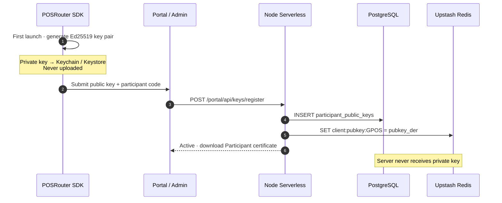
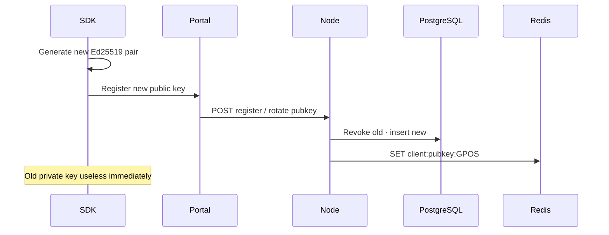

# Level 3 — Secure Lensing (Asymmetric) (V1.6)

| Language | Document |
|----------|----------|
| 中文 | [level-3-secure_cn.md](./level-3-secure_cn.md) |
| English | **this page** |

> **Audience:** Production alliance deployments requiring **non-repudiation**, client-generated key pairs, and Participant certificates. Self-implementation is difficult; **SDK strongly recommended**.

**Prerequisite:** [Level 2](./level-2-lensing_en.md) Lensing wire format unchanged; only Gateway `/init` authentication upgrades.

**Framework:** [README_en.md](./README_en.md)

---

## 1. Scope

Level 3 replaces symmetric HMAC `/init` (V1.4) with:

- **Ed25519 key pair generated on device**
- **Private key never leaves device**
- Server stores **public key only** (PostgreSQL + Redis cache)
- Digital signature on `/init` instead of HMAC
- Alliance-signed **Participant certificates**

Lensing subjects and JSON payloads remain as defined in Level 2.

---

## 2. Comparison: V1.4 vs Level 3

| | V1.4 (Level 2 current) | Level 3 (target) |
|--|------------------------|------------------|
| Client secret | Symmetric `key` (alliance issued) | **Private key** (local generation) |
| Server storage | Redis plaintext symmetric `key` | **Public key** (cache in Redis) |
| `/init` proof | HMAC | **Ed25519 signature** |
| Redis leak impact | Forger can HMAC | **Cannot** forge signatures |
| Onboarding | Admin generates key → Redis SET | SDK generates pair → Portal registers pubkey |

---

## 3. Onboarding and storage



| Storage | Content |
|---------|---------|
| SDK local | Ed25519 **private key** (Secure Enclave / Keychain / Android Keystore) |
| PostgreSQL | Public key DER/PEM, fingerprint, version, `revoked_at`, audit |
| Redis | `client:pubkey:{CODE}` = active public key (**not secret**) |

---

## 4. `/init` request (Level 3 target)

```http
GET https://lensing.starrie.org/init?code=GPOS
X-PR-Timestamp: <unix_ms>
X-PR-Signature: <base64 Ed25519 signature>
X-PR-Key-Id: <optional pubkey fingerprint / version>
```

**Canonical message to sign:**

```text
POSRouter/1\nGPOS\n<timestamp>
```

**Signature:** `Ed25519.sign(private_key, utf8(message))`, header value base64.

**Edge verification:**

1. `GET Redis client:pubkey:GPOS` (or version via `X-PR-Key-Id`)
2. Validate timestamp window
3. `Ed25519.verify(public_key, message, signature)`
4. Issue Lensing network credentials (same response shape as V1.4)

---

## 5. Public key rotation

```text
SDK generates new key pair locally
  → Portal submits new public key
  → Node: mark old pubkey revoked in PG · insert new record
  → Redis: SET client:pubkey:GPOS = new pubkey
  → Old private key signatures immediately invalid
```

Rotation is entirely client-driven for private keys; server only switches trusted public keys.



---

## 6. Participant certificate

Alliance-signed artifact binding **public key + participant metadata**:

```text
Certificate: code · org name · pubkey fingerprint · validity
Signed by alliance CA private key (Node only, HSM / env var)
Download: Portal · Blob stores PDF/PEM
Verification: SDK / third parties with alliance CA public key
```

---

## 7. Storage responsibilities (V2 target)

| Data | PostgreSQL | Redis |
|------|------------|-------|
| Orgs / users / roles | ✓ | — |
| Public key versions / rotation audit | ✓ | active pubkey only |
| API audit / reports | ✓ | optional rate limits |
| `/init` hot path | pubkey archive | `client:pubkey:{CODE}` |
| Certificate metadata | ✓ | — |
| Certificate PDF / PEM | metadata | Blob / S3 |

> V1.4 symmetric `client:key:{CODE}` deprecated after migration.

---

## 8. Rollout plan

| Phase | Content |
|-------|---------|
| **Now (V1.6)** | Level 2 symmetric HMAC remains in production |
| **Level 3 development** | SDK local keygen · Portal pubkey register · Edge Ed25519 verify · retire HMAC |
| **Skip** | V1 intermediate Postgres `key_hash` + Redis ciphertext blob paths |

**Greyscale:** When both `client:key:` and `client:pubkey:` exist for a participant, Gateway prefers Ed25519; pure V1.4 participants continue HMAC until migrated.

---

## 9. Level 3 limitations

Secure `/init` authenticates **participant identity to Gateway**. Future work may extend secure envelopes to Lensing message bodies; current V1.6 wire messages remain unsigned JSON on TLS + network token.

---

## 10. Document history

| Version | Change |
|---------|--------|
| V1.4 | Asymmetric model specified in consolidated README |
| V1.5 | Split Level 3 doc; align version labels; rollout greyscale notes |
| V1.6 | Renamed **Secure** (`level-3-secure_*`, formerly `signed`) |
