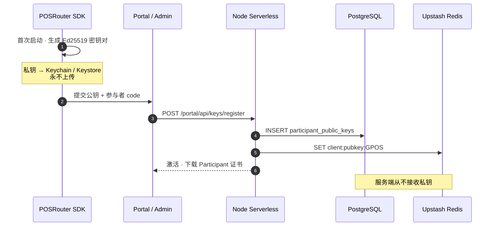
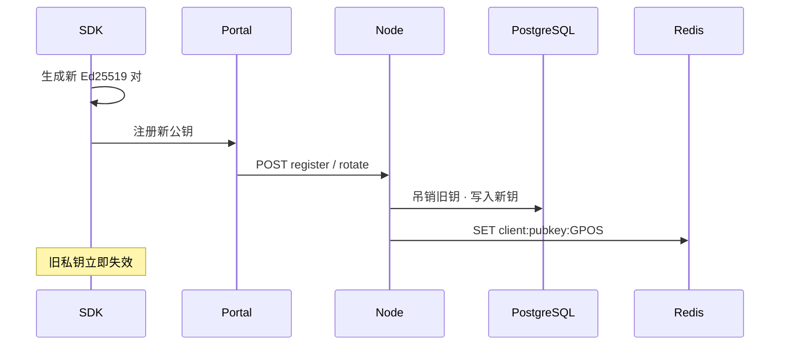

# Level 3 — 签名 Lensing（非对称） (V1.5)

| 语言 | 文档 |
|------|------|
| 中文 | **本页** |
| English | [level-3-signed_en.md](./level-3-signed_en.md) |

> **适用对象：** 生产联盟环境，需要 **不可抵赖**、客户端生成密钥对、Participant 证书。自行实现难度高，**强烈建议使用 SDK**。

**前置：** [Level 2](./level-2-lensing_cn.md) NATS 有线格式不变；仅 Gateway `/init` 鉴权升级。

**总览：** [README_cn.md](./README_cn.md)

---

## 1. 范围

Level 3 将 V1.4 对称 HMAC `/init` 替换为：

- 设备本地生成 **Ed25519 密钥对**
- **私钥永不离开设备**
- 服务端仅存储 **公钥**（PostgreSQL + Redis 缓存）
- `/init` 使用 **数字签名** 替代 HMAC
- 联盟签名的 **Participant 证书**

NATS Subject 与 JSON 载荷仍按 Level 2 定义。

---

## 2. 对比：V1.4 vs Level 3

| | V1.4（Level 2 现行） | Level 3（目标） |
|--|----------------------|-----------------|
| 客户端秘密 | 对称 `key`（联盟下发） | **私钥**（本地生成） |
| 服务端存储 | Redis 明文对称 `key` | **公钥**（Redis 缓存） |
| `/init` 证明 | HMAC | **Ed25519 签名** |
| Redis 泄露 | 可伪造 HMAC | **无法**伪造签名 |
| 入网 | Admin 生成 key → Redis | SDK 生成 pair → Portal 注册公钥 |

---

## 3. 入网与存储



| 存储 | 内容 |
|------|------|
| SDK 本地 | Ed25519 **私钥** |
| PostgreSQL | 公钥 DER/PEM、fingerprint、版本、`revoked_at`、审计 |
| Redis | `client:pubkey:{CODE}` = 当前 active 公钥（**非秘密**） |

---

## 4. `/init` 请求（Level 3 目标格式）

```http
GET https://lensing.starrie.org/init?code=GPOS
X-PR-Timestamp: <unix_ms>
X-PR-Signature: <base64 Ed25519 签名>
X-PR-Key-Id: <可选公钥 fingerprint / 版本>
```

**待签名消息（canonical）：**

```text
POSRouter/1\nGPOS\n<timestamp>
```

**签名：** `Ed25519.sign(private_key, utf8(message))`，Header 传 base64。

**Edge 验签：**

1. `GET Redis client:pubkey:GPOS`（或按 `X-PR-Key-Id` 取版本）
2. 校验时间戳窗口
3. `Ed25519.verify(public_key, message, signature)`
4. 签发 `nats_url` + `nats_token`（响应形态与 V1.4 相同）

---

## 5. 公钥轮换

```text
SDK 本地生成新密钥对
  → Portal 提交新公钥
  → Node：PG 标记旧公钥 revoked · 写入新记录
  → Redis：SET client:pubkey:GPOS = 新公钥
  → 旧私钥签名立即失效
```

私钥轮换完全在客户端；服务端只切换信任的公钥。



---

## 6. Participant 证书

联盟 CA 对 **公钥 + 参与者元数据** 的签名产物：

```text
内容：code · 组织名 · 公钥 fingerprint · 有效期
联盟 CA 私钥签名（仅 Node，HSM / 环境变量）
下载：Portal · Blob 存 PDF/PEM
验真：SDK / 第三方用联盟 CA 公钥
```

---

## 7. 存储职责（V2 目标）

| 数据 | PostgreSQL | Redis |
|------|------------|-------|
| 组织 / 用户 / 角色 | ✓ | — |
| 公钥版本 / 轮换审计 | ✓ | 仅当前 active 公钥 |
| API 审计 / 报表 | ✓ | 可选限流 |
| `/init` 热路径 | 公钥归档 | `client:pubkey:{CODE}` |
| 证书元数据 | ✓ | — |
| 证书 PDF / PEM | 元数据 | Blob / S3 |

> V1.4 对称 `client:key:{CODE}` 迁移完成后废弃。

---

## 8. 实施节奏

| 阶段 | 内容 |
|------|------|
| **现在（V1.5）** | Level 2 对称 HMAC 继续用于生产 |
| **Level 3 开发** | SDK 本地 keygen · Portal 公钥注册 · Edge Ed25519 验签 · 退役 HMAC |
| **跳过** | V1 中间态 Postgres `key_hash` + Redis 密文 blob 路径 |

**灰度：** 参与者维度同时存在 `client:key:` 与 `client:pubkey:` 时，Gateway 优先验 Ed25519；纯 V1.4 参与者继续 HMAC 直至迁移完成。

---

## 9. Level 3 边界说明

签名 `/init` 认证 **参与者身份与 Gateway**。未来可扩展 NATS 消息体签名信封；当前 V1.5 有线消息仍为 TLS + NATS token 保护下的未签名 JSON。

---

## 10. 文档历史

| 版本 | 变更 |
|------|------|
| V1.4 | 非对称模型写在整合 README 中 |
| V1.5 | 独立 Level 3 文档；统一版本号；补充灰度说明 |
